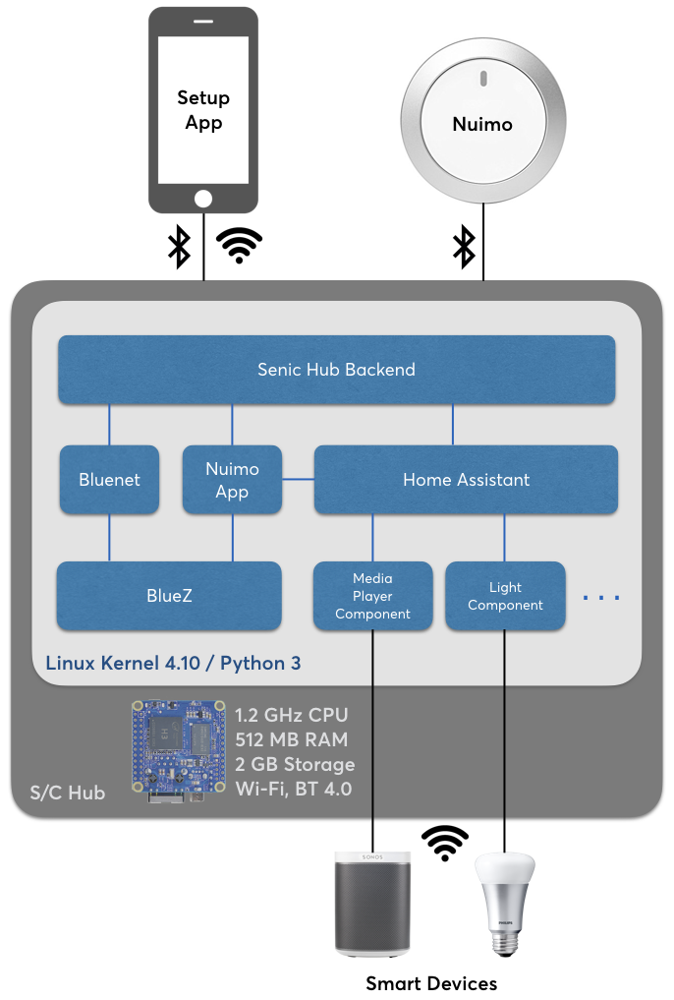
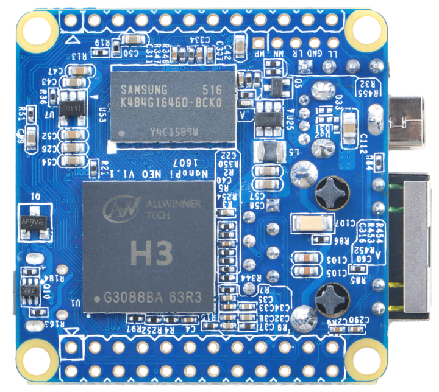

.. _index:

*********************************
Senic Hub Technical Documentation
*********************************

:Author: Senic GmbH
:Version: |version|

What is the Senic Hub
=====================

The Senic Hub is a Bluetooth Low Energy and Wi-Fi-enabled smart home hub that allows a user to connect to their smart devices (such as Sonos, Philips Hue etc). It also works together with the Senic Nuimo, a bluetooth controller for smart devices. The software for the Senic Hub builts on top of many great open source projects.

Why We Built the Senic Hub
==========================

The `Senic Hub <http://blog.senic.com/posts/what-were-building-next>`_ is the first major step in Senic’s vision to make technology that is `not focused on ‘stickiness’ <http://blog.senic.com/posts/the-problem-of-attention>`_ but on `well being for the human <http://blog.senic.com/posts/design-for-wellbeing>`_. At Senic, we see a massive problem of companies creating apps and products that try to optimize the use time and amount of attention. Instead we would like to promote wellbeing by creating connected devices, experiences, interfaces and systems that provide the user with seamless technological experiences. Our software is built on top of an open source platform in order to allow third party developers, other companies and user to see our code base and contribute.

System Overview
===============

Technical Details
=================

To build the Senic Hub for ease-of-use, programmability and updatability and also power, we made many technical decisions. Some decisions were right clear from the beginning, while others required a thorough understanding of what our smart home users need and what we can build with fairly limited resources of a startup. To outline our core reasoning behind these decisions, we would like to share some of the key insights, requirements and learnings so far.

Hardware Platform: Nano Pi Neo
------------------------------

The Senic Hub is powered by a `Nano Pi Air <http://wiki.friendlyarm.com/wiki/index.php/NanoPi_NEO>`_, a tiny but powerful single board computer equipped with an Allwinner H3 CPU and 512 MB DDR3 RAM. We not only pack it with a 2 GB high speed memory card that stores our operating system and software stack. We also extend it with high class Wi-Fi and Bluetooth 4.0 dongles to provide the best wireless connectivity.

Operating System: Linux
-----------------------

For the Senic Hub, we wanted to use the open-source systems as much as possible. Linux is a great open-source operating system. We chose it because it’s considered very stable and has support for various hardware platforms that are important to most of our developers and users. We’re using the latest Linux Kernel 4.10 and building our own distribution to have full control over which tools become part of the Linux subsystem. Having as few as possible tools running lets us reduce the amount of moving the parts and thus achieve a higher system availability.

Home Controlling and Automation: Home Assistant
-----------------------------------------------

.. image:: home-assistant.png
   :align: right
   :width: 90 px
   :height: 90 px

Despite being a new market, smart home is already seeing tons of different connected devices such as speakers, light, switches, thermostats or electronic door locks from thousands of companies. The issue of the industry, is that each of the device is using different communication channels and different protocols. Keeping up with the sheer volume of new smart devices being launched is nearly impossible without a strong developer community. `Home Assistant <https://home-assistant.io>`_ has exactly that, it has a massive number of devices that are supported and a large developer community who add, contribute and improve the support for various smart devices.

Programming Language: Python
----------------------------

.. image:: python.png
   :align: right
   :width: 115 px
   :height: 112 px

Why did we decide that Python was the right programming language for the Hub? A better question might be: Why shouldn’t we use Python? If you take a deep dive into the open-source smart home world, you will find a number of do-it-yourself projects and Python is often the language of choice for these DIYers. This adoption of Python is primarily due to the sheer number of readymade libraries and Python’s omnipresent availability for many different operating systems. In addition, Python is an easy to learn and extremely powerful and expressive as a programming language. The Python ecosystem has already been adopted by `more than 2 million developers <https://blog.pythonanywhere.com/67/>`_.

Developing for the Senic Hub
============================

Details coming soon for Senic Hub launch on June 20th.
